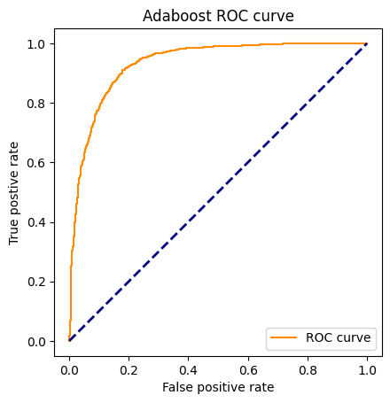
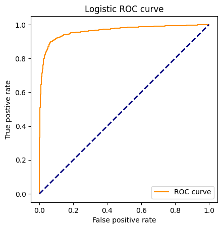

## 目录
- [目录](#目录)
- [实验方法：](#实验方法)
- [实验结果](#实验结果)
  - [训练](#训练)
  - [检测](#检测)

## 实验方法：
1. 关于haar特征提取，adaboost模型，人脸检测的内容全部为手动从零实现，具体代码可以参考code文件下的代码。logistic regression模型是调用sklearn的api;
2. 将所有图片按大约4:1分为train_set和test_set,在训练时用train_set;
3. 在数据处理时，利用经验公式和已知的五官坐标算出人脸的大致坐标，再resize到24*24大小。计算人脸大致坐标代码如下:
```python
def locate_face(img, coordinates):
    height, width, _ = img.shape
    leye_x, leye_y, reye_x, reye_y, nose_x, nose_y, mouth_x, mouth_y = coordinates
    center_x = nose_x
    center_y = nose_y
    face_h = 2*(mouth_y-(leye_y+reye_y)/2)
    face_w = 2*(reye_x-leye_x)
    top = max(0, round(center_y-(face_h/2)*1.5))
    bottom = min(height, round(center_y+face_h/2))
    left = max(0, round(center_x-face_w/2))
    right = min(width, round(center_x+face_w/2))

    y = top
    x = left
    w = right - left
    h = bottom - top

    coordinates = (x, y, w, h)
    return coordinates
```
再在图片中截掉人脸，再从图片中取24*24大小，作为负样本;
4. 受限于硬件和时间限制，在提取样本haar特征时，以步长为4，8，12分别提取haar特征；在检测时，仅进行步长为12的haar特征提取;
5. 在adaboost中训练弱分类器一步中，为了**避免遍历所有样本的同一特征，加快训练速度**，先将特征从小到大排序，然后根据不等号方向从左右两边进行错误的累加，再利用numpy库numpy.cumsum的特性优化了代码。部分代码如下：
```python
def _compute_error(self, weights, labels, inequality):
    if inequality == 'lt':
        errors_left = np.cumsum(weights * (labels == -1))
        errors_left = np.concatenate((np.array([0]), errors_left[:-1]))
        errors_right = np.cumsum(
            weights[::-1] * (labels[::-1] == 1))[::-1]
        errors_right = np.concatenate((errors_right[1:], np.array([0])))
        rest_errors = errors_left + errors_right
    else:
        errors_left = np.cumsum(weights * (labels == 1))
        errors_left = np.concatenate((np.array([0]), errors_left[:-1]))
        errors_right = np.cumsum(
            weights[::-1] * (labels[::-1] == -1))[::-1]
        errors_right = np.concatenate((errors_right[1:], np.array([0])))
        rest_errors = errors_left + errors_right
    return rest_errors + weights * (labels != -1)
```
6. 对于logistic模型，样本特征是将之前提取到的24*24的所有正负样本直接展平，获得576维度的特征，而不进行haar特征的提取。
7. 在检测时，对图片进行不同尺度，不同位置的块进行检测，检测出置信度大于阈值的框进行非极大值抑制（NMS）后与Ground Truth框进行IoU计算，如果>0.5则判断为检测成功，否则为失败。由于硬件和时间限制，仅使用用步长为12的haar+adaboost模型和logistic regression进行检测。

## 实验结果 

### 训练

model | parameter  |dataset | f1  | auc | acc
-- | -- |-- | -- | -- | --
adaboost *(32 weak classifier)* | stride = 12 |train_set | 88.40 | 86.87 | 86.45 
^ |^  |test_set  | 85.89 | 85.26 | 84.97
^ |stride = 8| train_set | 89.78 | 87.69 | 87.80
^ |^  |test_set  | 85.94 | 84.90 | 84.79
^ |stride = 4| train_set | 90.3 | 88.75 | 88.73
^ |^  |test_set  | **87.78** | **87.05** | **86.86**
logistic regression|shape=(24, 24) | train_set | 93.91 | 92.30 | 92.61
^ | ^ |test_set |**91.68** | **90.52** | **90.72**

两个模型的ROC曲线如下：


可以看出，在训练的时候两个模型效果都比较好，相比较而言logistic效果更好；提取haar特征时**步长越短，效果越好**。

### 检测
与上述训练结果相反的是，在检测中两个模型的效果都并不理想：
model | acc
-- | --
35.26 | 30.72

我认为可能的理由有：
1. 特征方面：haar特征步长过小，提取到的特征不足；logistic模型仅使用24*24的特征训练，同样可能过少;
2. 训练方面: 由于硬件与时间限制，不能以步长为1且足够多尺度的窗口对图像进行检测。
